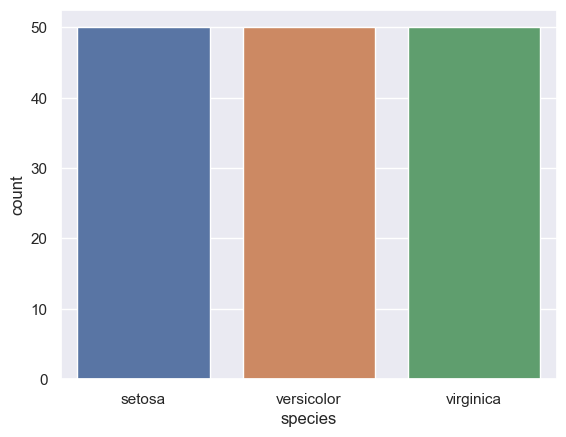
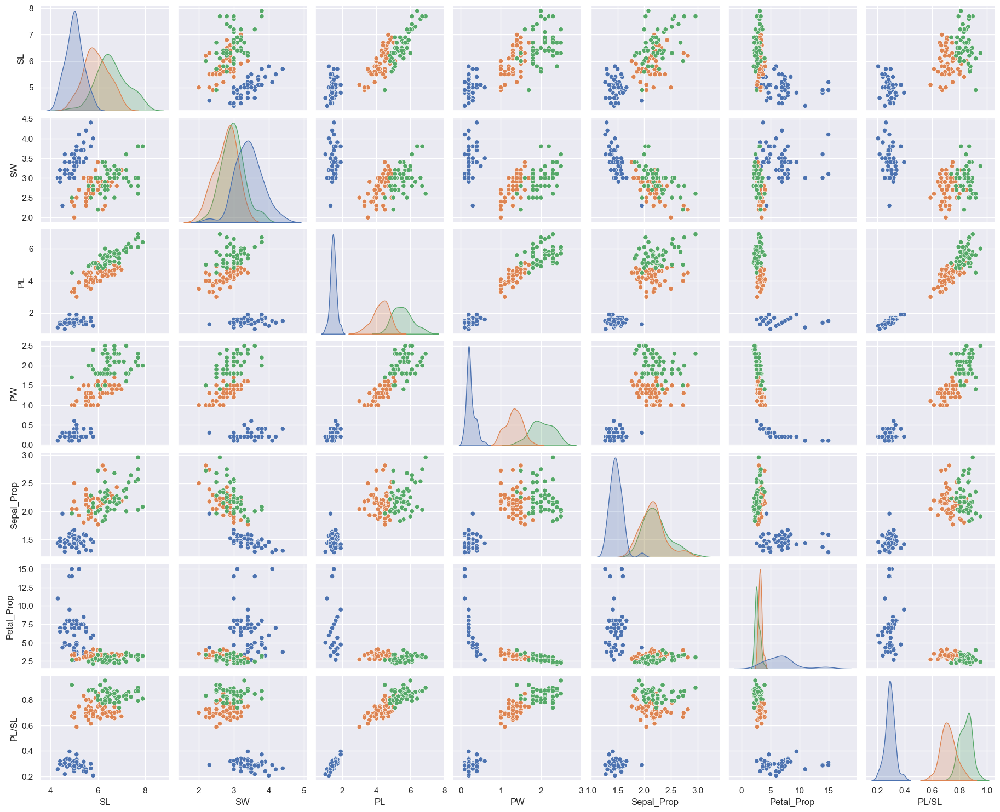

# The famous Iris flower data set

The Iris flower data set or Fisher's Iris data set is a multivariate data set used and made famous by the British statistician and biologist Ronald Fisher in his 1936 paper _The use of multiple measurements in taxonomic problems_ as an example of linear discriminant analysis.

The data set consists of 50 samples from each of three species of Iris (Iris setosa, Iris virginica and Iris versicolor). Four features were measured from each sample: the length and the width of the sepals and petals, in centimeters.


## Project structure

```
├─ img/
├─ notebooks/
├─ src/

```

`img`: images used to document this project <br />
`notebooks`: notebooks used during analysis and model training <br />
`src`: helper functions used during analysis

## Business understanding

The objective of the project is to perform exploratory data analysis (EDA) and train a model capable of classifying a flower into one of three species. This project follows the CRISP-DM framework.

## Data understanding

The dataset contains a set of 150 records under five attributes: sepal length, sepal width, petal length, petal width, and species. In this section, we explored the distribution of data across different species. The number of samples for each of the three species was the same, as we can see in the chart below, meaning we don't have any kind of imbalance between classes.



The next step was to understand the characteristics and statistics of each feature, including its distribution, mean values, standard deviation, and to check for outlier values. A summary of this can be seen through the boxplot below. As we can see, there are a few outliers in the distribution, but these are real values, which means we cannot discard them as they could also occur in future samples. Also through this chart, it is possible to identify that Iris Setosa has a very different distribution of values for petal length and petal width, with no overlap between its values and those of the other two classes.


After that, we looked at the relation between features. In this step, we first created three new features calculated from the existing ones.

<table>
    <tr>
        <th>feature</th>
        <th>observation</th>
    </tr>
    <tr>
        <td>Petal_Prop</td><td>rate between petal length and petal width</td>
    </tr>
     <tr>
        <td>Sepal_Prop</td><td>rate between sepal length and sepal width</td>
    </tr>
         <tr>
        <td>SPL/SL</td><td>rate between petal length and sepal length</td>
    </tr>
</table>

With these features, we explored the relation between each one, for each species. As we can observe, petal length and petal width seem to have a strong relation. Also from the plots, we can clearly see that Iris Setosa can be easily separated from the other two, as it was previously suggested when we analyzed the distribution of our data. 



We can see how strong the correlation between features is through the correlation matrix. A correlation matrix is a table that displays the correlation coefficients between pairs of variables. This helps visualize the strength and direction (positive or negative) of relationships within a dataset.


## Data preparation

To make a streamline process of all the transformations and features engineering we've created a pipeline where the new features as computed.

## Modeling

The modeling phase is where se select the models that will be used, our goal is to classify new samples of flower in one of the three species, so we will use classifiers and compare the results the models selected are

<table>
    <tr>
        <th>Model</th>
        <th>Library</th>
    </tr>
    <tr>
        <td>Decision Tree Classifier</td>
        <td>scikit-learn</td>
    </tr>
    <tr>
        <td>Random Forest Classifier</td>
        <td>scikit-learn</td>        
    </tr>
        <tr>
        <td>SVM Classifier</td>
        <td>scikit-learn</td>        
    </tr>
    </tr>
        <tr>
        <td>KNN Classifier</td>
        <td>scikit-learn</td>        
    </tr>
        </tr>
        <tr>
        <td>MLP Classifier</td>
        <td>scikit-learn</td>        
    </tr>
</table>

We first split the DataFrame into features (X) and our target variable (y). After that, it was necessary to encode our target variable. We used a `LabelEncoder` to assign a different numeric value to each of the species.

Next, we had to split our data into training and testing sets. For this, we used the `train_test_split` function from the scikit-learn library. The data doesn't have many observations, so we decided to use 20% of it for testing and 80% for training. `random_state` was set to 0 for reproducibility purposes

```
X_train, X_test, y_train, y_test = train_test_split(X, y, test_size=0.2, random_state=0)
```

Here's the corrected and enhanced text:

For each model, we trained it using the training set without modifying any hyperparameters; we used the default values. After training, we predicted the class labels of observations in the test dataset and computed _Accuracy_, _Balanced Accuracy_, _Precision_, _Recall_, and _F1-score_ for each model. The results are as follows:

<table>
    <tr>
        <th>Model</th>
        <th>Accuracy</th>
        <th>Balanced Accuracy</th>
        <th>Precision</th>
        <th>Recall</th>
        <th>F1-score</th>
    </tr>
    <tr>
        <td>Desicion Tree</td>
        <td>96.67%</td>
        <td>97.44%</td>
        <td>96.67%</td>
        <td>96.67%%</td>
        <td>96.67%</td>
    </tr>
        <tr>
        <td>Random Forest</td>
        <td>100%</td>
        <td>100%</td>
        <td>100%</td>
        <td>100%%</td>
        <td>100%</td>
    </tr>
    <tr>
        <td>SVM</td>
        <td>100%</td>
        <td>100%</td>
        <td>100%</td>
        <td>100%%</td>
        <td>100%</td>
    </tr>
    <tr>
        <td>KNN</td>
        <td>100%</td>
        <td>100%</td>
        <td>100%</td>
        <td>100%%</td>
        <td>100%</td>
    </tr>
    <tr>
        <td>MLP</td>
        <td>100%</td>
        <td>100%</td>
        <td>100%</td>
        <td>100%%</td>
        <td>100%</td>
    </tr>
</table>

All models had excelent results predicting the classes in the _testing_ set. _Decision Tree Classifier_ was the only one that missed 1 prediction. While such high scores might indicate an _overfitting_ this is not the case, this is a relatively small and easy dataset so getting results like this is expected.

 

To help us visualize any errors, we also plotted the confusion matrix for each model, because only Decision Tree Classifier missed a classification, all confusion matrixes are the same except one


This last one is the confusion matrix of Decision Tree classifiers, as it might be observed the error happene when the model classified as _virginica_ a _versicolor_ observation.
